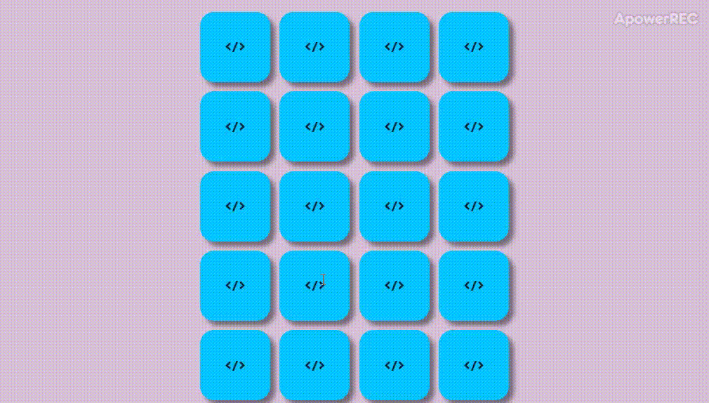

# MemoryGame
<h1>🎮 Memory game using front-end technologies 🤓</h1>

<h2>&#9997 Game create using concept MVC </h2>

File Model is game.js, file View is index.html and file Controller is script.js

<h2>&#9654 Installation and start game</h2>
<ul>
  <li>Clone repository</li>
  <li>Start file index.html</li>
</ul>
<h2>&#128187 Technology used</h2>
<ul>
  <li>Javascript</li>
  <li>HTML</li>
  <li>CSS</li>
</ul>